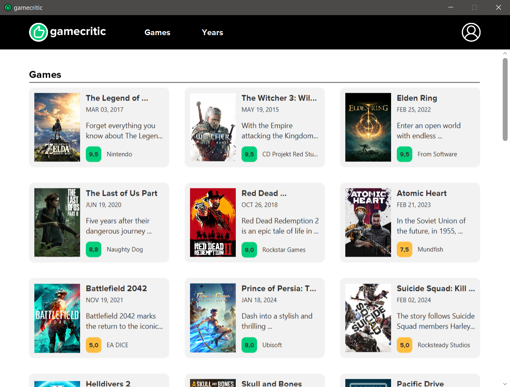
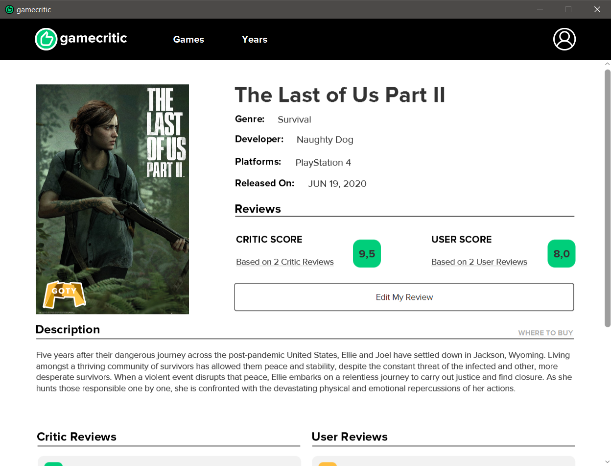
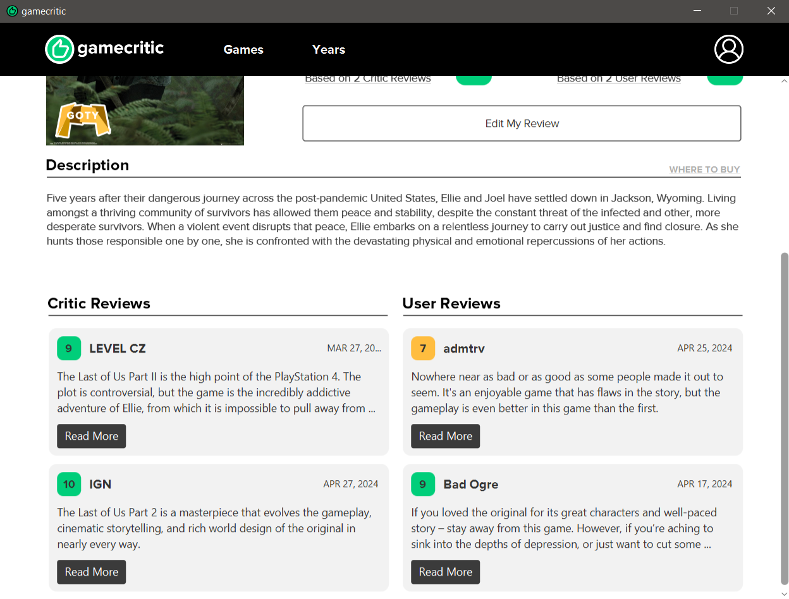
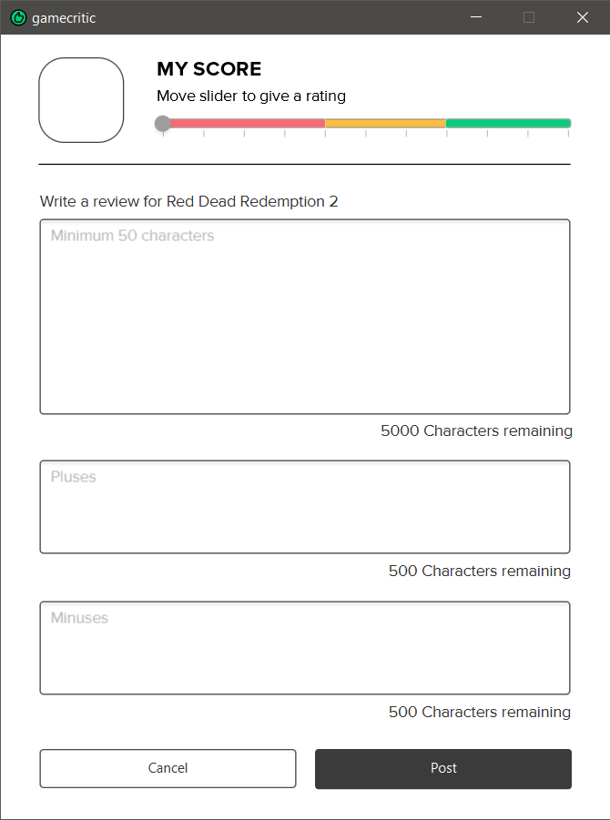
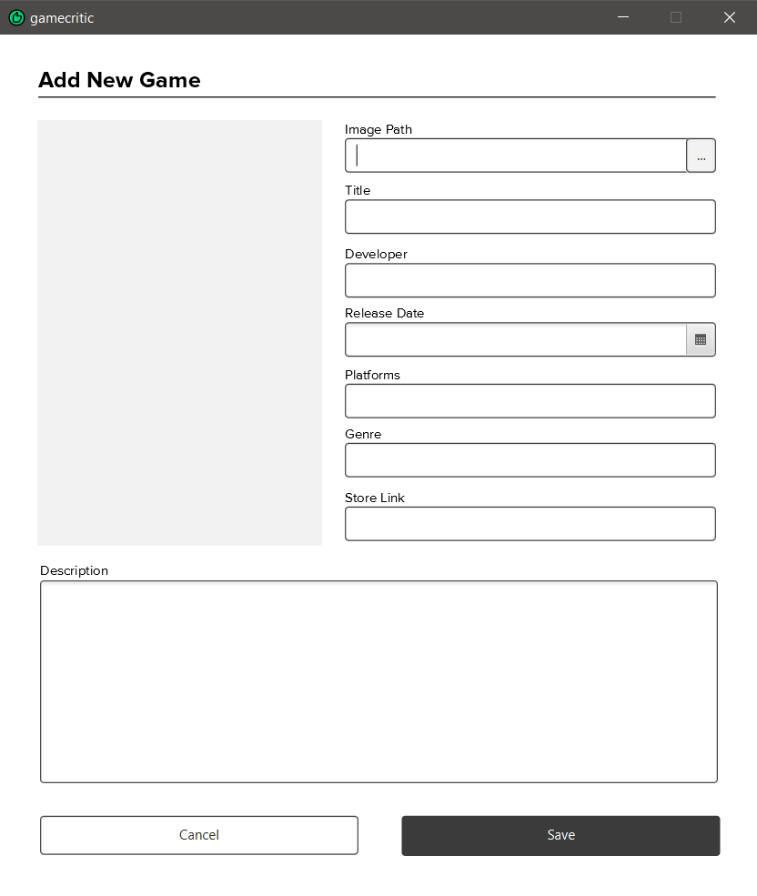
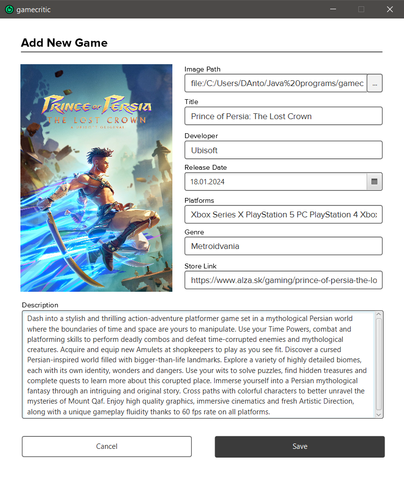
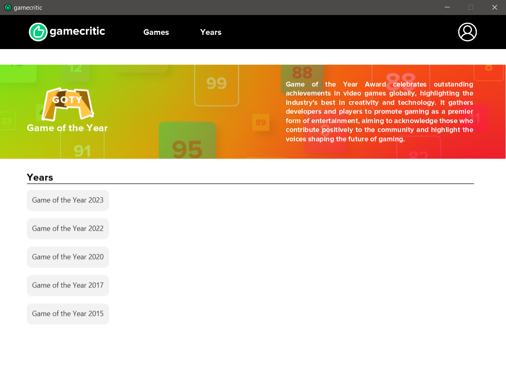

## Introduction
**GameCritic** is a video game reviews portal that gives players and critics from around
the world the opportunity to provide their opinions on the latest releases in the
world of video games. This is a community where every vote counts, and on the
basis of these votes an objective and comprehensive evaluation of the game is formed.
This further helps in identifying the best games of the year in various genres through
public voting. This provides users a reliable source of information in choosing games
for a quality experience.

## Functionality

1.	**User and Critic Evaluations:** Users and critics can rate and reviews new games, providing a complete view from both sides.
2.	**User Ratings:** Registered users can rate games on a scale of 1 to 10 and leave reviews. 
3.	**Critic Ratings:** Accredited game critics are able to write in-depth, professional reviews of newly released games and receive cash payments for doing this.
4.	**Rating Aggregation:** The system aggregates rating data to form a convenient and easy-to-understand rating for each game.
5.	**Verified stores:** The portal also provides links to verified stores, where you can buy your favorite game without any problems and without fear of scams.
6.	**Awards and year-end results:** At the end of each year there is a summary of the results, where games of different genres and categories will receive deserved awards based on their average score.
7.	**Categorization:** Games are categorized by genre to provide a fair comparison and competition.
8.	**Winners:** The games with the highest average scores in each genre are announced as winners and receive «GameCritic Game of the Year» awards.

## How to run the project

1. To run the project, you can simply build the program in your IDE (I use IntelliJ from JetBrains)
2. All the dependencies are already defined
3. Then you just need to run the AppController class, which is in the gui package

And that's it!

## Registration or Login

To enter the application you can either register a new user or use one of the existing:
* **For User:**  username `user1` and password `user123`
* **For Critic:**  username `critic1` and password `critic123`
* **For Administrator:**  username `admin1` and password `admin123`

After successful login, you will be redirected to the home screen.

## Home Screen
The home screen provides a user interesting selection of games by themes: 

The app itself has a button bar on top so that from any screen in the app, you can navigate to the desired screen. Here is a listing of how each button works:

* The `App Logo` is itself a button and always takes user to the home screen
* The `Games` button takes you to the navigation screen for all available games (Functionality not yet implemented!)
* The `Years` button takes the user to a selection of the best games by years
* The `User Icon` takes you to your personal cabinet where you can view and change your personal data

The `Game Cards` themselves take you to a screen to view detailed information about the pressed game.

## Personal Cabinet

Depending on the type of user, the personal cabinet may look different and provide different functionality.

This is how a personal cabinet can look like if the user is a `Сritic`:

Here the critic can see his current balance, which is accrued for reviewing games on the portal. When the balance becomes non-zero, the critic can pseudo withdraw money from his own account to a bank account. 

And this is how the personal cabinet can look like, if the user is an `Administrator`:

Here the administrator can press the button that launches the complex process of awarding the best games for the current year. Administrators also have the functionality to add new game to the system directly from the application.

## Games Library
The Games window is used to navigate through all available games in the application. Here everyone will be able to find the desired game and later give it a review. 

## Detailed Game View

If you click anywhere in the program on a certain game, the user will be taken to a detailed view of the game, which provides full information such as genre, developer, release date and etc. Also there is functionality to `Add Your Own Review` of the game, the option to go to the `Verified Store` to buy this game. If you scroll down the page below, you can see reviews from other users and critics on this game.

## Review Screen

When navigating to the reviews screen, if the reviews has not already been added, the user will be able to see the tools initialized to empty.

To add your own score just move the slider to the desired result, and to add a reviews you can simply write it in the text window. 

Critics have the functionality to add a more detailed review, which includes not only the text fields of the review, but also fields where you can separately highlight the pluses and minuses of the game. 
This allows them to provide a more complete and objective view of the product.

To save the results just click the `Post` button, otherwise, to return to the game, you can click the `Cancel` button. 

Depending on the score, the interface changes in the same way to make it clear whether the user gives the game a negative, medium or positive score. 

## Adding New Game Window
This interface window is intended for administrators to add new games to the application database. 

After filling in all the fields and pressing the confirmation button, the game is loaded and saved into the system and can be seen by all other users. 

## List of Years

This is where the user will get to if he or she clicks the `Years` button. It contains a list of all the years for which the Game of the Year Award was summarized.

Thereafter, just click on the desired year to go to the detailed results.

## Selected Year

Here you can see the detailed results, where the awarded games are divided by the categories in which they won. And in the same way, if you click on a game card you will be taken to a detailed overview of the game.
